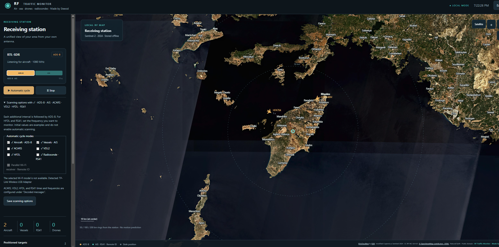

# RF Traffic Monitor

Created by **Steeod**.

**Multi-protocol SDR monitoring for Windows.** Track aircraft, ships, drones
and radiosondes from radio signals received at your own station.

RF Traffic Monitor is a local-first Windows dashboard for RTL-SDR and HackRF
receivers. It decodes ADS-B, AIS, ACARS, VDL2, HFDL and RS41 traffic, with
optional Wi-Fi Remote ID reception through a separate compatible adapter.
The dashboard runs locally at `http://127.0.0.1:8787`; it does not transmit
radio signals or send received data to feeder networks.

| Signal | What it displays |
|---|---|
| ADS-B 1090 MHz | Aircraft positions and telemetry |
| AIS | Vessel positions and identity data |
| ACARS / VDL2 / HFDL | Aviation messages and valid recent position reports |
| RS41 | Radiosonde identity, position and movement |
| Wi-Fi Remote ID | Compatible drone Basic ID and Location messages |

One SDR cycles between selected radio modes. Wi-Fi Remote ID capture uses a
separate adapter and can run alongside it. The station and map coordinates are
configurable, so the application is not tied to Rhodes or any other location.
The guided setup builds new offline maps around the location selected by each
user. No location is built into the product identity.

Three receiver configurations are available: RTL-SDR with optional Wi-Fi,
HackRF One with optional Wi-Fi, and Wi-Fi Remote ID only. The scan bar displays
every active slot in execution order, highlights the current decoder, and sizes
each segment by its configured duration. With ADS-B enabled, every additional
radio mode is followed by another ADS-B slot, preserving the configured ADS-B
priority while still rotating through all selected modes.

The interface, setup workflow, runtime messages, and documentation are in
English. Hardware reception still needs validation with the intended receivers
and antennas.

## Repository contents

- `app/`: controller, browser UI, C#/Rust/C adapters and Wi-Fi helpers.
- `tools/`: download, build, map preparation and portable packaging utilities.
- `tests/`: parsing, scheduling, HTTP and map checks.
- [Third-party credits](THIRD-PARTY.md): direct dependencies and upstream origins.
- [GitHub publishing procedure](PUBLISHING.md): source upload and release requirements.

`setup.ps1` turns this source checkout into a complete local portable build.

## Guided Windows setup

On a 64-bit Windows 10 or 11 computer, clone the repository and run:

```powershell
Set-ExecutionPolicy -Scope Process Bypass
.\setup.ps1
```

The setup asks for a city or region, shows matching OpenStreetMap/Nominatim
results and lets the user choose one. Latitude and longitude can also be passed
directly. It then:

1. Creates the ignored local receiver configuration with the chosen station name
   and coordinates.
2. Downloads all pinned application runtimes, decoder binaries, source archives,
   SDR libraries, Zadig and signed Alfa driver packages. Every downloaded file is
   checked against its expected SHA-256 before extraction.
3. Builds Natural Earth coastlines, OpenStreetMap place labels and an EOXCloudless
   offline satellite pyramid around the station. The default coverage radius is
   200 km, with detailed zoom around the nearest 50 km.
4. Installs Python, Rust and Visual Studio C++ Build Tools through `winget` when
   they are missing, unless `-SkipToolchainInstall` is used.
5. Builds the xng and OpenDroneID native decoders and the Virtual Radar bridge,
   collects dependency licenses, runs the tests and creates
   `dist/RFTrafficMonitor-0.10-win64.zip`.

For unattended location selection, for example:

```powershell
.\setup.ps1 -Latitude 37.9838 -Longitude 23.7275 `
  -StationName "Athens RF Station" -RadiusKm 200 -Receiver RTL -WifiSupport None
```

Use `-Receiver WiFi -WifiSupport Windows` for a station that has only a
compatible Wi-Fi adapter and will monitor Remote ID without an SDR.

The satellite data is optional because EOX 2024 imagery is CC BY-NC-SA 4.0 and
non-commercial. Use `-SkipSatellite -SkipPackage` for a source/dependency build
without it. Map generation requires internet access and can take significant
time and disk space.

### Driver hand-off

The setup downloads and verifies the drivers, but preserves the safety steps
that require knowing the physical device:

- **RTL-SDR or HackRF:** setup includes the signed Zadig 2.9 executable. When an
  RTL-SDR is detected without a working WinUSB driver, RF Traffic Monitor opens
  Zadig automatically once. In Zadig, select **Options → List All Devices**, choose
  the RTL-SDR's first interface (normally **Bulk-In, Interface 0**) and install
  **WinUSB**. The application cannot safely make the final device selection.
- **AWUS036H/AWUS036ACS with Windows WLAN:** when selected during setup, the
  matching Microsoft-signed driver is installed through `pnputil` after a UAC
  prompt. Windows WLAN scanning does not require Npcap.
- **Npcap raw capture:** install Npcap separately from its official site because
  its installer is not redistributed. Monitor-mode support still depends on the
  adapter and driver.
- **AWUS036ACS through WSL2:** setup downloads the WSL kernel/driver source bundle
  and installs `usbipd-win` after UAC. Windows may require WSL installation and a
  restart; the application then guides USB binding and the Linux driver build.

All downloads are cached under `downloads/`, so rerunning setup after a restart
or interrupted toolchain installation resumes without downloading valid files again.

The dashboard also checks connected Alfa hardware IDs. If a supported adapter
is present without a usable driver, it displays a prominent driver-required
message and an **Install bundled driver** button. RTL-SDR `usb_open error -5`
is reported as a WinUSB/device-busy problem instead of a generic receiver error.
HackRF error `-5` is reported as a busy or locked device; close other SDR tools
or reconnect the device before retrying. A successfully opened receiver can
still show no targets when the antenna, gain, frequency coverage, local traffic,
or reception conditions do not provide decodable signals.

## Development without the full bootstrap

Use Python 3.12 on Windows. Create local settings before running the application
or tests; keep an existing configuration if one is already present:

```powershell
if (!(Test-Path app/config.json)) { Copy-Item app/config.example.json app/config.json }
Push-Location tests
python -m unittest test_radar.ModelTests test_radar.ProcessTests -v
Pop-Location
```

That command runs the model and process tests available without vendor binaries.
With the full local dependencies and driver files provisioned, run
`python -m unittest discover -s tests -v` from the repository root for the full
suite. Binary and driver tests require files intentionally excluded from Git.

The Python controller uses the standard library. Satellite preparation uses a
pinned Pillow build installed by setup. Native reception requires the upstream binaries and libraries
listed in the credits. `Start.cmd` expects `app/runtime/python.exe`; developers
with Python installed can run `python app/server.py` after provisioning the
dependencies. Missing maps or decoders limit the available functionality.

`tools/prepare.py` downloads and lays out the complete external dependency set.
The native build requires Rust/MSVC, Visual Studio C++ Build Tools and upstream
sources at `.build/xng-0.21.0` and `.build/opendroneid-core-c-master`.
See [native build notes](tools/BUILD.md). The root `setup.ps1` automates these
steps for a clean Windows checkout.

Satellite tests are skipped when the satellite manifest is absent. To rebuild
the optional imagery after setup, run `python tools/prepare-satellite.py`;
this downloads data and can take considerable time and space.

## Licensing

Project-authored code and documentation are licensed under the
[MIT License](LICENSE). See [license scope](LICENSE-STATUS.md) and
[third-party credits](THIRD-PARTY.md) for components and data covered by other terms.

The optional EOX 2024 imagery is CC BY-NC-SA 4.0; that restriction applies to
the imagery, not automatically to every source file in this repository.

