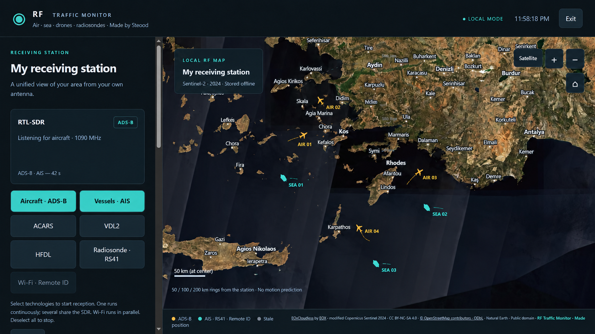

# RF Traffic Monitor

**Portable RF monitoring for Windows — aircraft, vessels, radiosondes and compatible drones.**
Created by **Steeod**.

RF Traffic Monitor brings signals received at your own station into a local
map and message dashboard. It supports RTL-SDR and HackRF receivers, with
optional Wi-Fi Remote ID through a separate compatible adapter.

**[Downloads and release notes](https://github.com/Steeod/RF-traffic-monitor/releases)**

*Illustrative product preview: aircraft and vessel markers were added for presentation;
they are not a recording of live reception. All technology buttons are visible.
Choose your own station and map region during setup.*

## Portable and local

- **Portable application:** Setup extracts the application into its own
  `RFTrafficMonitor` subfolder. Launch it with `Start.cmd`.
- Settings, downloaded maps and application logs stay in the application folder.
  Close the application before moving or backing up the whole folder.
- **Windows 10/11, 64-bit.** The packaged runtime and decoders are included;
  users do not need to install Python or development tools.
- Receiver drivers and optional Npcap/WSL support are separate system components
  and may need installation on each computer.

## Privacy and internet use

The dashboard runs on your computer at `http://127.0.0.1:8787`.
**Received aircraft, vessel, radiosonde and drone positions and decoded messages
are not uploaded to tracking websites, feeder networks or cloud services.**
No account or cloud dashboard is required.

Reception and previously downloaded maps work locally. Internet is used for
online place searches (the typed place name is sent to Photon), map downloads
(the requested map area is sent to the imagery provider), and optional driver
package downloads. Enter coordinates manually and use existing maps to avoid
these online setup features.

## What it supports

- **Aircraft:** ADS-B, ACARS, VDL2 and HFDL.
- **Vessels:** AIS.
- **Radiosondes:** RS41.
- **Drones:** compatible Wi-Fi Remote ID broadcasts.
- Offline maps, configurable station location and a demo without an SDR.

Reception depends on compatible hardware, drivers, antenna and local signals.

## Get started

1. Open [Releases](https://github.com/Steeod/RF-traffic-monitor/releases) and choose
   a release. Beta versions are marked as pre-releases.
2. For a new installation, download its **Setup EXE**. To update an existing
   installation, download its **update ZIP** and follow that release's instructions.
3. Run `Start.cmd` from the application folder and configure your station,
   receiver and map.
4. Select the technologies to receive. One selected SDR technology runs
   continuously; multiple technologies share the SDR. Deselect all to stop.

## Updates and help

Changes, fixes, installation details and known limitations are listed with each
[release](https://github.com/Steeod/RF-traffic-monitor/releases).

For a problem, open an [issue](https://github.com/Steeod/RF-traffic-monitor/issues)
with the application version, receiver model and steps to reproduce it.

For development, see [building and receiver setup](docs/BUILDING.md) and
[native decoder build notes](tools/BUILD.md).

## License

Project-authored code is [MIT licensed](LICENSE). See
[license scope](LICENSE-STATUS.md) and [third-party credits](THIRD-PARTY.md).
Optional EOX satellite imagery is CC BY-NC-SA 4.0 (non-commercial).
